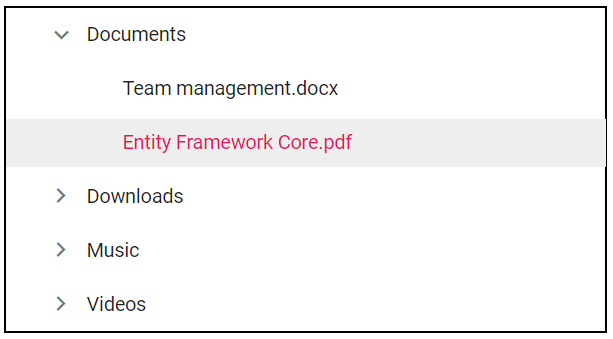

# EJ2 Angular 4 TreeView Quick Start

A quick start project that helps you to create the Syncfusion Angular 4 TreeView.



This is a Angular 4 project generated using [Angular CLI](https://github.com/angular/angular-cli) version 7.0.4. The TreeView features included in this project are as follows.

* showCheckBox - Shows/hides CheckBox.
* allowDragAndDrop - Enables/disables Tree node drag and drop.
* allowEditing - Enables/disables Tree node editing.

## How to run this application?
To run this application, you need to first clone the `ej2-angular-4-treeview` repository and then navigate to its appropriate path where it has been located in your system.

To do so, open the command prompt and run the below commands one after the other.

```
git clone https://github.com/SyncfusionExamples/ej2-angular-4-treeview ej2-angular-4-treeview
cd ej2-angular-4-treeview
```

## Installing
Once done with downloading, next you need to install the necessary packages required to run this application locally. The `npm install` command will install all the needed angular packages into your current project and to do so, run the below command.

```
npm install
```

## Running on development server
Run `ng serve` for a dev server. Navigate to `http://localhost:4200/`. The app will automatically reload if you change any of the source files.

## Further help

To get more help on the Angular CLI use `ng help` or go check out the [Angular CLI README](https://github.com/angular/angular-cli/blob/master/README.md).
